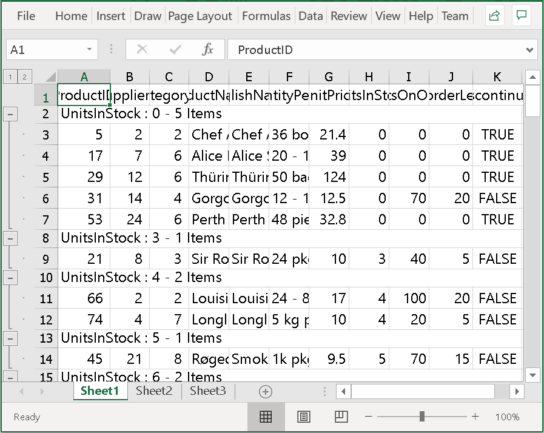

# How to Export WPF DataGrid to Excel that hasn't Loaded?

THis sample show cases how to export a [WPF DataGrid](https://www.syncfusion.com/wpf-controls/datagrid) (SfDataGrid) that hasn't been loaded yet.

You can export the datagrid to excel by using the [ExportToExcel](https://help.syncfusion.com/cr/wpf/Syncfusion.UI.Xaml.Grid.Converter.GridExcelExportExtension.html#Syncfusion_UI_Xaml_Grid_Converter_GridExcelExportExtension_ExportToExcel_Syncfusion_UI_Xaml_Grid_SfDataGrid_Syncfusion_Data_ICollectionViewAdv_Syncfusion_UI_Xaml_Grid_Converter_ExcelExportingOptions_) method in `DataGrid`. You can also export the `DataGrid` before it's loading (AutoGenerateColumns = True/False) by using the `DataGrid.ApplyTemplate` method.

```c#
private static void OnExecuteExportToExcel(object sender, ExecutedRoutedEventArgs args)
{
    var dataGrid = args.Source as SfDataGrid;
    EccelOptionsConverter ExcelOption=new EccelOptionsConverter();

    if (dataGrid == null) return;

    try
    {
        var options = args.Parameter as ExcelExportingOptions;
        ICollectionViewAdv view;
        ExcelEngine excelEngine = new ExcelEngine();
                
        options.ExcelVersion = ExcelVersion.Excel2010;
        options.ExportingEventHandler = ExportingHandler;

        if (!ExcelOption.isCustomized)
            options.CellsExportingEventHandler = CellExportingHandler;
        else
            options.CellsExportingEventHandler = CustomizeCellExportingHandler;

        dataGrid.ApplyTemplate();

        excelEngine = dataGrid.ExportToExcel(dataGrid.View, options);

        var workBook = excelEngine.Excel.Workbooks[0];

        SaveFileDialog sfd = new SaveFileDialog
        {
            FilterIndex = 2,
            Filter = "Excel 97 to 2003 Files(*.xls)|*.xls|Excel 2007 to 2010 Files(*.xlsx)|*.xlsx",
            FileName = "Book1"
        };

        if (sfd.ShowDialog() == true)
        {
            using (Stream stream = sfd.OpenFile())
            {
                if (sfd.FilterIndex == 1)
                    workBook.Version = ExcelVersion.Excel97to2003;
                else
                    workBook.Version = ExcelVersion.Excel2010;
                workBook.SaveAs(stream);                        
            }

            //Message box confirmation to view the created spreadsheet.
            if (MessageBox.Show("Do you want to view the workbook?", "Workbook has been created",
                                MessageBoxButton.YesNo, MessageBoxImage.Information) == MessageBoxResult.Yes)
            {
                //Launching the Excel file using the default Application.[MS Excel Or Free ExcelViewer]
                System.Diagnostics.Process.Start(sfd.FileName);
            } 
        }                                              
    }
    catch (Exception)
    {

    }
}
```

